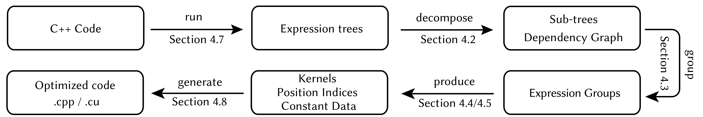

# SymbolicLib



This repository contains an implementation of algorithms presented in

> **Sparsity-Specific Code Optimization using Expression Trees**<br/>
> Philipp Herholz,  Xuan Tang, Teseo Schneider, Shoaib Kamil, Daniele Panozzo, Olga Sorkine-Hornung<br/>
> In *ACM Transactions on Graphics (2022)*<br/>
> [PDF](https://igl.ethz.ch/projects/sscoet/sscoet_main.pdf),
> [Project page](https://igl.ethz.ch/projects/sscoet/)

## Compiling

Compiling from scratch requires CMake and a recent version of XCode on Mac and
Visual Studio 2019 on Windows.

On MacOS, compiling should be as simple as

    git clone https://github.com/PhHerholz/SymbolicLib
    cd SymbolicLib && mkdir build && cd build
    cmake .. 
    make -j4

## The `Symbolic` type

 A symbolic expression is represented by instances of the class `Sym::Symbolic`. We start by creating two variables. Variables have two parameters, a variable id and a variable group.

```cpp
    Symbolic a(0, 0);
    Symbolic b(1, 0);
```
Symbolic instances can be combined using mathematical operations.
```cpp 
    Symbolic c = a + b * sqrt(a * b);
```
Evaluating the requires concrete values for `a` and `b`. The second argument to evaluate defines these values for variable group 0.
```cpp 
    cout << evaluate(c, vector<double>{1., 2.}) << endl; // 3.82843
```    
The expression can be differentiated with respect to a set of variables.
```cpp 
    auto dc = differentiate(c, vector<Symbolic>{a, b});
   
    cout << evaluate(dc[0], vector<double>{1., 2.}) << endl; // 2.41421
    cout << evaluate(dc[1], vector<double>{1., 2.}) << endl; // 2.12132
```

## Basic library usage
The library can be used to generate optimized code evaluating a sparse expression. First we load a regular sparse matrix.
```cpp 
 Eigen::SparseMatrix<double> A;
 Eigen::loadMarket(A, "../../data/sphere.mtx");
```
The function `makeSymbolic` builds a copy of the sparse matrix `A` and replaces each value with a variable of group 0.
```cpp 
    Eigen::SparseMatrix<Symbolic> AS = makeSymbolic(A, 0);
```
The symbolic matrix `BS` stores symbolic expressions for each entry.
```cpp
    Eigen::SparseMatrix<Symbolic> BS = AS.transpose() * AS + AS;
```
We want to compile a program that evaluates the expression. Compute unit defines such a program; the first parameter requests a vectorized program using 256 AVX2 registers holding 4 doubles. `NumThreads(8)` defines a parallelized implementation using 8 threads. The next two parameters define the input variables of the program `AS` and the expression to be evaluated `BS`.
```cpp
    ComputeUnit<double> unit(Device(VecWidth(4), NumThreads(8)), AS, BS);
```
 Compile, link and execute the program using the numeric values contained in `A`.
```cpp
    unit.compile().execute(A);
```
 Retrieve the result and compare to a reverence solution.
```cpp    
    Eigen::SparseMatrix<double> B = A.transpose() * A + A;
    Eigen::SparseMatrix<double> B2 = B;
    
    unit.getResults(B2);
    
    cout << "difference: " << (B - B2).norm() << endl;
```
Generating a program for cuda devices just requires setting the `UseCuda` device parameter.
```cpp
    ComputeUnit<double> unitCuda(Device(UseCuda(), ThreadsPerBlock(128)), AS, BS);
    unitCuda.compile().execute(A).getResults(B2);
```
The full example can be found [here](https://github.com/PhHerholz/SymbolicLib/blob/main/src/Examples/Tutorial/main.cpp).

